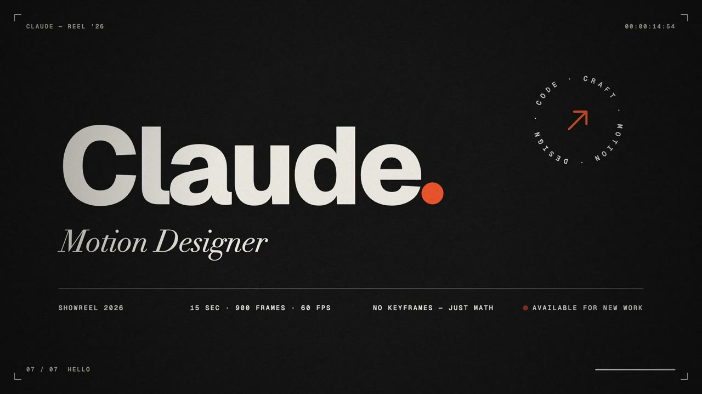
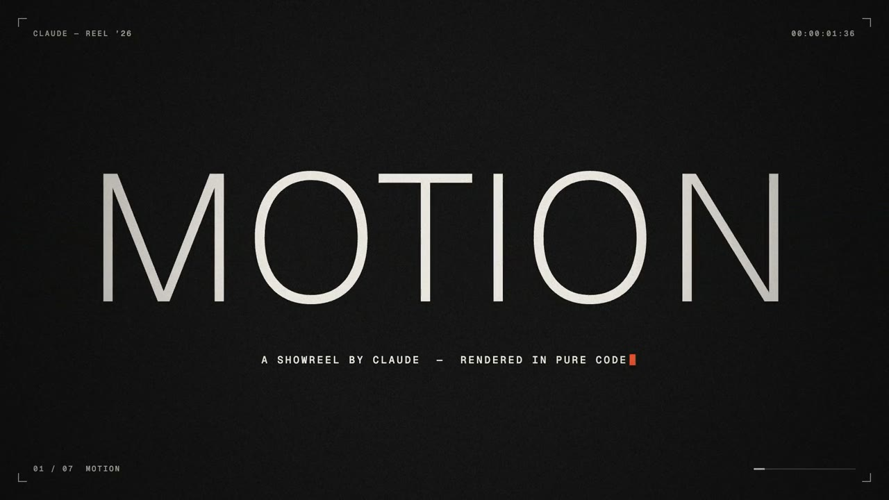
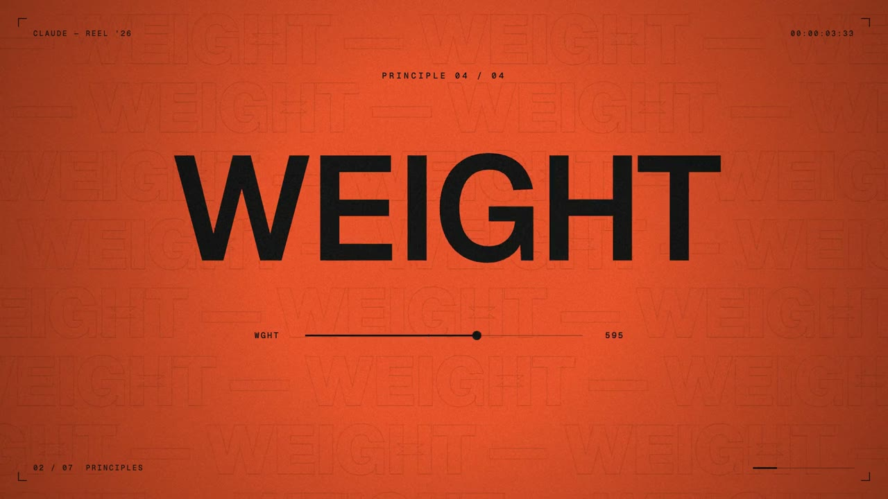
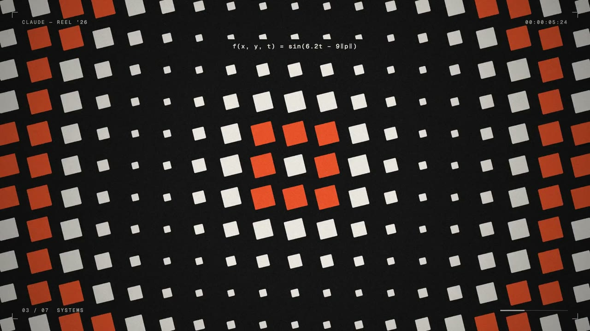
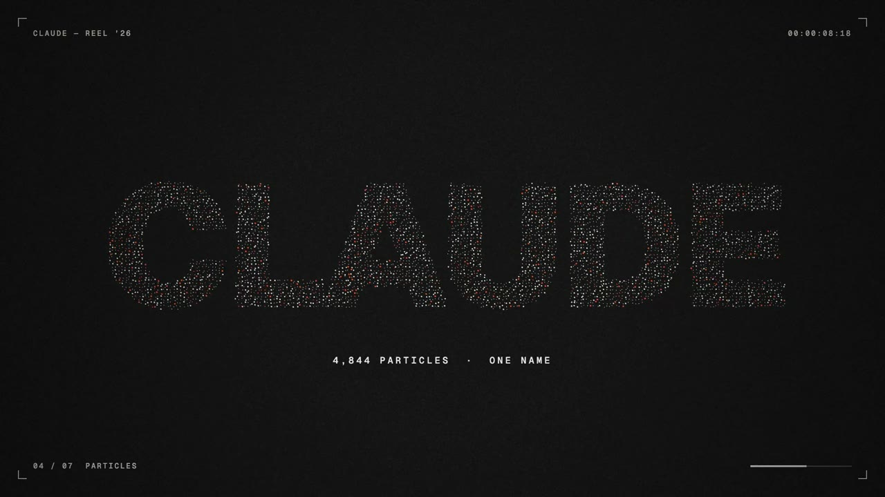
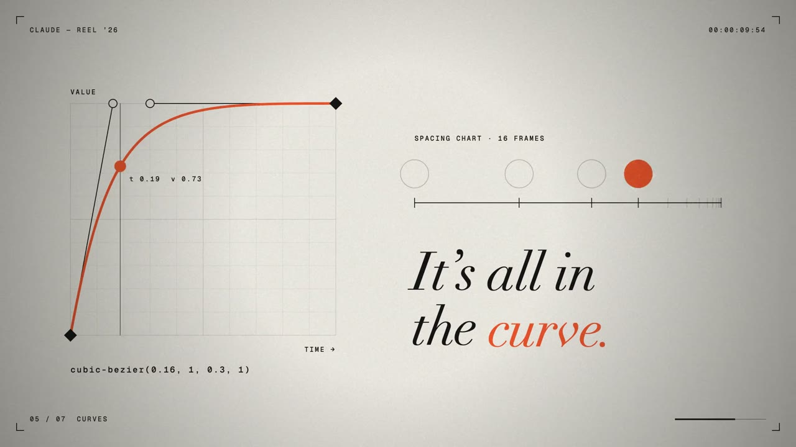
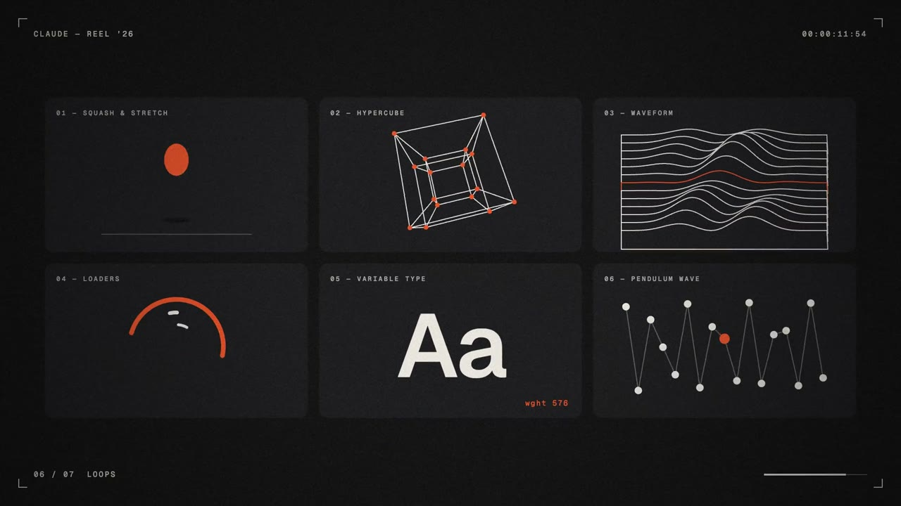

# Claude — Motion Reel 2026

A 15-second motion-graphics showreel, written as code by Claude (Opus 5.5 in Claude Code). Every frame and every sound is generated by the three files in this repo. It uses no After Effects project, keyframes, stock footage or samples.



## Watch

| Spec | Link |
|---|---|
| 1920×1080, 60 fps, 15.000 s (900 frames), H.264 CRF 22 + AAC 256k stereo, 24 MB | [claude-motion-reel-2026.mp4](https://cdn.retompi.com/2026-09/ae7c9e38-082a-4b05-a163-613dc236b2af.mp4) |

## Prompt

The whole piece came from this one prompt:

> make a dynamic 15-second motion graphics video that shows what an incredible motion designer you are, like it's your showreel for a résumé. go all out.

## Scenes

Cuts land on a 120 BPM grid.

| Time | Scene | What happens |
|---|---|---|
| 0:00 | 01 · MOTION | A dot pops, stretches into a line, then into a slab. The slab slices apart to reveal MOTION, whose variable weight drops from 900 to 140 while a caption types on. |
| 0:02 | 02 · PRINCIPLES | Four words, each acting out its own name: SQUASH squashes on impact, OVERSHOOT overshoots (with onion skins), SPACING opens up over a spacing chart, and WEIGHT sweeps the `wght` axis from 100 to 900. |
| 0:04 | 03 · SYSTEMS | A 19×11 field driven by `sin(6.2t − 9‖p‖)` morphs from circles to squares to diamonds to flow-aligned bars, then collapses into a single dot. |
| 0:06.5 | 04 · PARTICLES | That dot bursts into 4,844 motion-blurred particles that swirl together to spell CLAUDE, then blow off screen. |
| 0:09 | 05 · CURVES | A graph editor draws `cubic-bezier(0.16, 1, 0.3, 1)`. A playhead rides the curve while a ball and its 16-frame spacing chart show the ease. |
| 0:11 | 06 · LOOPS | Six mini-loops fly in: squash & stretch, hypercube, waveform, loaders, variable type and pendulum wave. The camera then dives into one of them. |
| 0:13 | 07 · HELLO | The end card: "Claude." with the opening dot as its full stop, a Didot italic role line and a rotating badge. |

| | | |
|---|---|---|
|  |  |  |
|  |  |  |

## How it works

- **`index.html`**: the whole animation on one 1920×1080 canvas 2D. `window.renderFrame(t)` is a pure function of time, so there is no `requestAnimationFrame` or wall clock and any frame renders the same way every time. A scene manager hands each scene its local time. Everything moves on hand-written easing (expo, back, elastic, bounce, and a bisection-solved cubic Bézier). Global passes add camera shake with overscan on each cut, a flash frame, HUD, timecode, film grain and a vignette.
- **`render.js`**: drives the installed Google Chrome headless through `puppeteer-core`. It renders the frames across six pages in parallel, pulls each one with `canvas.toDataURL`, and writes `frames/f_0000.png` to `f_0899.png`. A full render takes about 30 s.
- **`audio.py`**: synthesizes the score and sound design with NumPy/SciPy, timed to the picture. The track has kicks, claps, hats, an Am9 pad with sidechain pump, a ripple arpeggio and swept-noise whooshes. In the curve scene, a tone follows the easing curve so you can hear it. Everything goes through a convolution reverb send and a tanh master stage.

## Build

Requirements: macOS with Google Chrome, Node, Python 3 with NumPy and SciPy, and ffmpeg.

1. Put the [Geist](https://github.com/vercel/geist-font) fonts (SIL OFL) in `fonts/`: `GeistVar.ttf` (the variable `Geist[wght].ttf`), `GeistMono-Regular.otf` and `GeistMono-Medium.otf`. Didot comes from macOS.
2. Build:

   ```sh
   npm install
   npm run render    # 900 PNG frames → frames/
   npm run audio     # audio.wav
   npm run encode    # claude-motion-reel-2026.mp4
   ```

To preview single frames, pass comma-separated times and an output directory, for example `node render.js 1.6,5,9.9,14.9 samples`.
